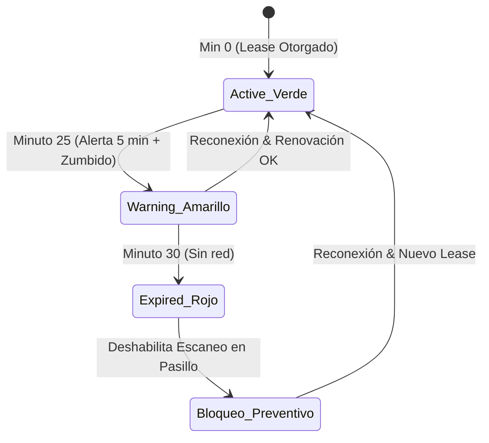
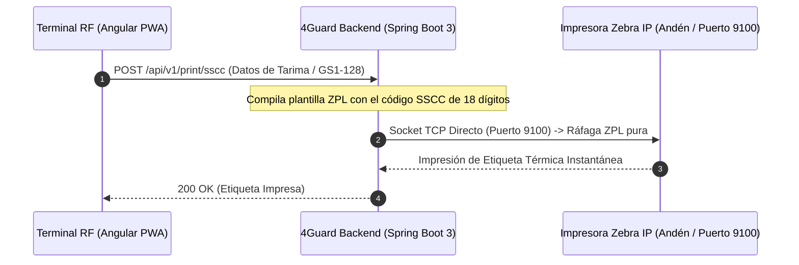

# ADR-012: Arquitectura Offline-First, Protocolo Zone Lease, Impresión ZPL y UX Industrial para la Terminal RF PWA (rf-terminal)

- **Estado:** Aceptado
- **Fecha:** 2026-09-10
- **Autores:** Equipo 4Guard WMS Frontend & Backend
- **Módulos Afectados:** `rf-terminal`, `shared-core`, `4guard_be`

---

## 1. Contexto Arquitectónico y Stack Tecnológico

El sistema **4GUARD WMS** está construido bajo una arquitectura empresarial desacoplada de alto rendimiento:

### A) Arquitectura Backend (`4guard_be`)
* **Patrón Arquitectónico**: **Arquitectura Hexagonal (Ports & Adapters)** con diseño guiado por el dominio (DDD).
  * `domain/`: Entidades de negocio puras, enums de dominio, puertos de entrada (`Ports In`) y puertos de salida (`Ports Out`).
  * `application/`: Casos de uso (`Services`), DTOs de petición/respuesta y mappers MapStruct.
  * `infrastructure/`: Adaptadores de persistencia JPA, entidades PostgreSQL, adaptadores de seguridad y clientes de infraestructura.
  * `presentation/`: Controladores REST, OpenAPI Swagger y manejador global de excepciones.
* **Lenguaje & Framework**: **Java 21 LTS** + **Spring Boot 3.x**.
* **Base de Datos**: **PostgreSQL 15+** en esquema dedicado `wms`.
* **Control de Versiones de BD**: **Flyway** (migraciones versionadas `V1__` a `V12__`).
* **Seguridad & Autorización**: **Spring Security 6** con **JWT Bearer Stateless**, encriptación **BCrypt**, RBAC y autoridades granulares.
* **Integración de Hardware**: Sockets TCP directos (Puerto 9100) para envío de ráfagas ZPL puras a impresoras térmicas industriales Zebra.

### B) Arquitectura Frontend (`4Guard_FE_UI`)
* **Estructura**: **Nx Monorepo** con separación de responsabilidades:
  * `apps/admin-console`: Consola web de escritorio (Puerto 4200).
  * `apps/rf-terminal`: Progressive Web App (PWA) móvil para operadores de piso y montacarguistas (Puerto 4201).
  * `libs/shared-core`: Librería compartida de modelos, enums de dominio, servicios de estado e interceptores.
* **Framework**: **Angular 17+ Standalone Components** (sin NgModules, zero boilerplate).
* **Gestión de Estado**: **Angular Signals** (`signal`, `computed`, `effect`, `inject`), eliminando la complejidad de NgRx en favor de reactividad nativa.
* **Persistencia Offline**: **IndexedDB** (`4guard_rf_db`) como almacén transaccional local.
* **Service Worker**: `@angular/service-worker` (`ngsw-worker.js`, `manifest.webmanifest`) para caché del App Shell y tolerancia a fallos.
* **Ergonomía & Hardware**: Web Audio API para osciladores de sonido industrial (bip/buzzer), API de Vibración Háptica, Canvas HTML5 para compresión de imágenes en el cliente y listeners globales de ráfagas de escáner láser Zebra/Honeywell.

---

## 2. Contexto Operativo y Problema de Negocio

Las operaciones de piso en almacén (andenes de carga/descarga, pasillos de racks y cámaras frigoríficas) son ejecutadas por operadores de montacargas, estibadores e inspectores de calidad (`WAREHOUSE_OPERATOR`, `MANEUVER_OPERATOR`, `QUALITY_INSPECTOR`).

Estas operaciones presentan cinco desafíos críticos:
1. **Intermitencia de Red Wi-Fi**: Zonas ciegas de cobertura dentro de pasillos con estructuras metálicas densas.
2. **Riesgo de Colisión Operativa**: Dos montacarguistas intentando mover, asignar o pickear físicamente la misma mercancía simultáneamente al operar desconectados.
3. **Restricción de Sandbox PWA para Impresión Industrial**: Los navegadores web no pueden abrir sockets directos ni comunicarse por Bluetooth/Serial con impresoras térmicas Zebra ZPL de andén.
4. **Saturación de Almacenamiento por Evidencias**: Las fotografías de daños o siniestros en alta resolución saturan rápidamente la cuota de almacenamiento del navegador.
5. **Pérdida de Foco en Lecturas Láser**: Si el operador toca fuera del input principal, los escáneres Zebra/Honeywell pierden la captura de ráfagas de teclado.

---

## 3. Opciones Evaluadas

1. **Opción 1: Web App 100% Online con Drivers Locales**
   - *Descartada:* Inoperable en zonas ciegas; requiere software puente de terceros instalado en cada handheld para imprimir.

2. **Opción 2: PWA Offline-First con IndexedDB (`4guard_rf_db`), Zone Lease Escalonado (HU-155), Impresión ZPL por Socket Backend (HU-031), Compresión Canvas y Global Laser Listener [SELECCIONADA]**
   - *Pros:* Opera de forma ininterrumpida; previene colisiones con temporizador local estricto; comprime evidencias a ~150 KB; captura ráfagas láser globales; imprime por socket TCP 9100 sin drivers en el cliente; mantiene el monorepositorio Angular 17.
   - *Contras:* Requiere coordinación de estado y colas de arbitraje.

3. **Opción 3: Aplicación Nativa Android (Kotlin / APKs)**
   - *Descartada:* Rompe la homogeneidad del stack web y exige mantenimiento y despliegue manual de APKs en decenas de dispositivos.

---

## 4. Decisión Tomada

Se define la arquitectura de **`apps/rf-terminal` (Puerto 4201)** bajo los siguientes pilares de ingeniería:

### A) Base de Datos Local IndexedDB (`4guard_rf_db`)

La persistencia local en el navegador se estructura en 4 almacenes de objetos (*Object Stores*):

```text
4guard_rf_db
├── auth_cache             # [PK: user_id] JWT cifrado, rol, expiración estricta (8-12 hrs)
├── zone_leases            # [PK: zone_id] lease_token, granted_at, expires_at (30 min), status (ACTIVE, WARNING, EXPIRED)
├── offline_transactions   # [PK: id (autoincrement)] action_type, payload (JSON), evidence_photo_blob (~150KB), sync_status
└── sync_conflicts         # [PK: transaction_id] server_error_code, details para arbitraje del supervisor
```

---

### B) Protocolo de Arrendamiento Exclusivo — Zone Lease con Temporizador Local (HU-155)

Para garantizar cero colisiones de inventario durante desconexiones:
1. **Solicitud de Lease**: La PWA solicita `POST /api/v1/rf/zone-leases` antes de entrar a un pasillo. Si está ocupado por otro operador, el backend Spring Boot responde `409 Conflict`.
2. **Temporizador Local de 3 Fases en la PWA**:
   * **Minuto 0 a 25 (🟢 ACTIVE)**: Operación normal offline, encolando en `offline_transactions`.
   * **Minuto 25 (🟡 WARNING)**: Alerta visual y zumbido háptico: *"Tu arrendamiento vence en 5 min. Acércate a zona con red para renovar"*.
   * **Minuto 30 (🔴 EXPIRED)**: **Bloqueo Preventivo Local**. La pantalla de escaneo para ese pasillo se deshabilita automáticamente, impidiendo registros que colisionen con otro operador.



---

### C) Arquitectura de Impresión ZPL en Andén (HU-031)

Para evitar las restricciones de sandbox del navegador, la PWA delega el despacho de impresión al backend:



---

### D) Middleware de Compresión de Fotografía de Evidencia (HU-020, HU-164)

Para reportes de mercancía dañada (HU-020) y colapso de pallets (HU-164), el cliente comprime la imagen mediante Canvas HTML5 antes de almacenarla en IndexedDB:
* **Resolución máxima**: $1024 \times 768$ px.
* **Formato y calidad**: JPEG al 75% ($\approx 150\text{ KB}$).
* **Beneficio**: Evita exceder la cuota local de almacenamiento y agiliza la sincronización por red celular/Wi-Fi.

---

### E) Intercepción Global de Lectores Láser (`[appGlobalBarcodeScanner]`)

Directiva angular con `@HostListener('window:keydown')` que evalúa el delta de tiempo entre caracteres:
* **$\Delta t < 30\text{ ms}$**: Identificado como ráfaga de escáner industrial (Zebra/Honeywell).
* **Captura Universal**: Captura el código escaneado aunque el operador haya hecho clic fuera del input principal.

---

### F) Seguridad y Vigencia de Sesión Offline (HU-002)

* La sesión offline se almacena cifrada en `auth_cache` con vigencia estricta de **8 a 12 horas** (duración de un turno).
* Al detectar cualquier reconexión a red, se valida el token contra el backend; si fue revocado, se purga la caché local inmediatamente.

---

### G) Resolución de Conflictos al Sincronizar (HU-156)

Al recuperar conexión, la cola `offline_transactions` se transmite en orden cronológico:
* Si la versión central coincide (Optimistic Locking): Aplica la mutación y libera el lease token.
* Si hay discordancia de versión (**`VERSION_MISMATCH`**): Se encola en `sync_conflicts` y se envía al panel de arbitraje del Supervisor (`admin-console`) para decisión humana (Aprobar, Rechazar o Reconteo).

---

### H) Máquina de Estados Finita (FSM Numérica)

```text
[10: En Andén] ➔ [20: Cuarentena] ➔ [30: Disponible] ➔ [40: Reservado] ➔ [50: En Picking] ➔ [60: Despachado]
                                  ↘ [80: Dado de Baja (Merma / Colapso)] ↙
```

---

### I) Estándar de Ergonomía Táctil para Operación con Guantes y Movimiento

Para garantizar operatividad sin errores cuando los montacarguistas y estibadores usan guantes de cuero/carnaza o conducen montacargas sujetos a vibración mecánica continua:

1. **Touch Targets de Grado Industrial (WCAG 2.5.5 Ampliado)**:
   * **Botones primarios y de confirmación**: Altura mínima de **$56\text{ px}$ a $64\text{ px}$**.
   * **Espaciado de seguridad inter-botón**: Margen mínimo de **$\ge 12\text{ px}$** para evitar pulsaciones accidentales de botones adyacentes.
2. **Prevención de Gestos Accidentales**:
   * Desactivación global de zoom dactilar accidental: `touch-action: manipulation`.
   * Desactivación de selección de texto involuntaria: `user-select: none` en contenedores de acción.
3. **Legibilidad a Distancia y bajo Vibración (Distancia 60 - 80 cm)**:
   * Identificadores críticos (**SSCC, Código de Bahía / Rack, Lote**) renderizados en tipografía monoespaciada (`'JetBrains Mono'`) con tamaño $\ge 1.4\text{rem}$ y contraste AAA sobre fondo oscuro `#0b1119` o claro `#ffffff`.
4. **Multimodalidad Inmersiva**:
   * Cada acción exitosa detona feedback sonoro (bip senoidal 880 Hz) y háptico (50 ms) para operar sin necesidad de desviar la vista fija hacia la pantalla en cada movimiento de carga.

---

### J) Diseño Responsivo Adaptativo (Tablets de Montacargas vs Handhelds Portátiles)

La Terminal RF debe auto-adaptar su diseño ergonómico según el factor de forma del dispositivo de campo:

1. **Tablets de Montacargas (Orientación Horizontal / Landscape 8" a 10" — 1024x600 / 1280x800)**:
   * **Layout 2 Columnas**: Panel izquierdo con datos de la tarima/tarea activa y panel derecho con teclado numérico gigante o vista 3D de rack.
   * Navegación optimizada para soporte fijo a la altura de la cabina.
2. **Handhelds Rugerizadas Portátiles (Orientación Vertical / Portrait 4.5" a 6.0" — Zebra TC52/MC3300 / Honeywell EDA51)**:
   * **Layout 1 Columna Lineal**: Pasos apilados secuencialmente con botones al 100% del ancho para pulsación natural con el pulgar.
   * Barra de navegación inferior fija para acceso rápido con una sola mano.

---

## 5. Consecuencias

### Positivas
- Operación ininterrumpida y a prueba de zonas ciegas en andenes y pasillos.
- Cero colisiones de inventario gracias al Zone Lease escalonado con bloqueo preventivo a los 30 minutos.
- Impresión industrial instantánea sin configuraciones de drivers en terminales móviles.
- Uso óptimo de la memoria local mediante compresión de imágenes a ~150 KB.
- Captura de códigos infalible gracias al listener global de eventos láser.
- Coherencia arquitectónica total con Hexagonal Backend + Angular Signals Frontend.

### Compromisos
- Requiere que las impresoras térmicas de andén estén alcanzables por IP en la red del backend (puerto 9100).
- Requiere interfaz de resolución de conflictos en la consola de administración (`admin-console`).

---

## 6. Notas de Auditoría y Verificación

1. **Verificación de Zone Lease**: Validar que al minuto 25 se active la alerta visual/auditiva y al minuto 30 se bloquee el formulario si no hubo reconexión.
2. **Verificación de Compresión**: Validar que fotos tomadas con cámaras de 48MP/12MP se almacenen en IndexedDB con un peso $\le 200\text{ KB}$.
3. **Verificación de Escáner Global**: Hacer clic en el fondo de la pantalla, disparar el escáner láser y verificar que el código se procese exitosamente.
4. **Verificación de Impresión ZPL**: Ejecutar `POST /api/v1/print/sscc` y validar la recepción del socket en el puerto 9100.
