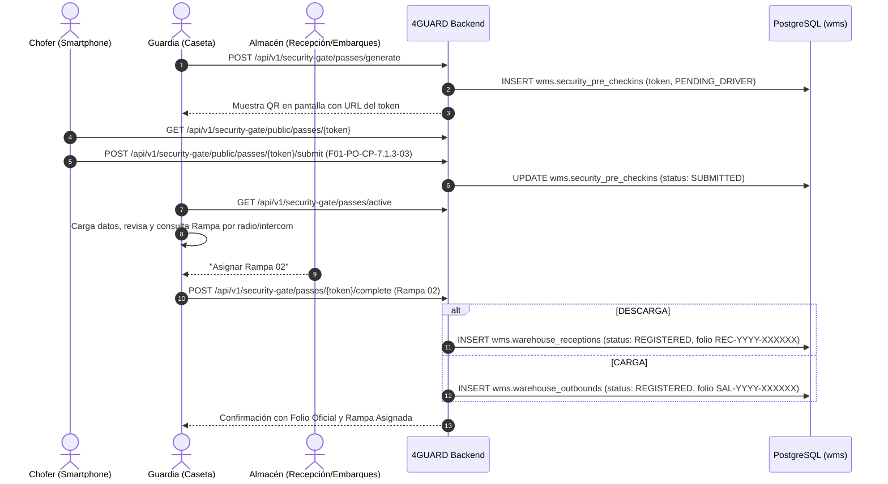

# ADR-017: Caseta de Seguridad Bimodal, Pases Digitales QR para Choferes y Aislamiento de Rol de Vigilancia

- **Estado:** Aceptado
- **Fecha:** 2026-09-17
- **Autores:** Equipo de Arquitectura e Ingeniería 4GUARD WMS (Frontend, Backend & BD)
- **Módulos Afectados:**
  - `apps/admin-console/src/app/features/security` (Caseta de Seguridad & Portal de Chofer)
  - `libs/shared-core/src/lib/domain/enums/role.enum.ts` (RBAC Security Guard)
  - `4guard_be/src/main/java/com/fourguard/wms/application/usecase/SecurityGateService.java`
  - `4guard_be/src/main/java/com/fourguard/wms/presentation/controller/SecurityGateController.java`
  - `4guard_be/src/main/java/com/fourguard/wms/infrastructure/persistence/entity/SecurityPreCheckinEntity.java`
  - `wms.security_pre_checkins`, `wms.roles`, `wms.permissions`, `wms.warehouse_receptions`, `wms.warehouse_outbounds`

---

## 1. Contexto y Problema Operativo

1. **Gestión Bimodal en Caseta de Seguridad (Carga vs. Descarga):**
   - En la caseta de vigilancia se presentan dos tipos de vehículos y operaciones logísticas:
     - **DESCARGA (Inbound / Recepción):** Mercancía que entra al centro de distribución para ser descargada, verificada y almacenada en racks.
     - **CARGA (Outbound / Embarque / Salidas):** Vehículos que ingresan para ser cargados y despachados con pedidos de clientes.
   - Anteriormente, el pre-registro de caseta únicamente creaba recepciones (`REC-YYYY-XXXXXX`), careciendo de la contraparte para crear salidas pre-registradas (`SAL-YYYY-XXXXXX`).

2. **Auto-Registro Móvil del Transportista vía Código QR:**
   - Para agilizar el tráfico en el carril de acceso a planta y evitar errores de captura manual por parte del guardia, el chofer debe poder escanear un código QR con su smartphone y completar el Formato Oficial `F01-PO-CP-7.1.3-03` (Transporte, Checklist de EPP, Estado de la Caja, Sellos de Seguridad y Firma Digital).
   - El sistema debe recibir los datos del chofer en tiempo real, permitiendo al guardia de seguridad revisarlos, editarlos o complementarlos si es necesario, solicitar la asignación de rampa a Recepción/Embarques y autorizar la entrada formal a planta.

3. **Aislamiento Estricto del Rol de Guardia de Seguridad (RBAC):**
   - El personal de vigilancia no debe tener acceso a información sensible de inventario, finanzas, usuarios o configuración global del WMS. Su interfaz debe estar aislada exclusivamente al módulo de Caseta de Seguridad (`/security`).

---

## 2. Decisiones de Arquitectura

### 2.1 Modelo de Datos para Pases Digitales (`wms.security_pre_checkins`)
- Se implementa la tabla `wms.security_pre_checkins` gestionada por Flyway (`V21__add_security_guard_role_and_precheckin_schema.sql`).
- Cada pase tiene un `token` único (`PASS-YYYYMMDD-XXXX`), fecha de expiración (24 horas), estatus del ciclo (`PENDING_DRIVER`, `SUBMITTED`, `COMPLETED`, `CANCELLED`), datos del vehículo, checklist JSONB y firma digital en base64/timestamp.

### 2.2 Endpoints Públicos vs. Autenticados en Spring Security
- **Públicos (Móvil Chofer):**
  - `GET /api/v1/security-gate/public/passes/{token}`
  - `POST /api/v1/security-gate/public/passes/{token}/submit`
- **Autenticados (Guardia / Admin):**
  - `POST /api/v1/security-gate/passes/generate`
  - `GET /api/v1/security-gate/passes/active`
  - `POST /api/v1/security-gate/passes/{token}/complete`

### 2.3 Portal Móvil Autónomo de Auto-Registro (`/carrier-checkin`)
- Componente Angular Standalone `CarrierCheckinComponent` optimizado para dispositivos móviles:
  - Diseño responsive y fluido con paso a paso (Wizard 1 a 4).
  - Selector de Operación (CARGA / DESCARGA) con ajuste dinámico de validaciones (Remisión vs. Carta Porte).
  - Captura táctil de firma digital mediante HTML5 Canvas interactivo.
  - Validación de EPP y revisión física de la caja.

### 2.4 Control de Acceso y Aislamiento de Rol (`SECURITY_GUARD`)
- Nuevo rol `UserRole.SECURITY_GUARD` (`ROLE_SECURITY_GUARD`) en `libs/shared-core` y base de datos.
- En `auth.state.ts`:
  - Los usuarios con rol `SECURITY_GUARD` / `VIGILANCIA` solo tienen permitido el acceso al módulo `security`.
  - Al iniciar sesión, son redirigidos inmediatamente a `/security`.
  - El menú de navegación (sidebar) solo muestra "Caseta de Seguridad".

---

## 3. Consecuencias y Beneficios

1. **Eficiencia y Tiempos de Espera:**
   - La captura previa por parte del chofer elimina cuellos de botella en la caseta de acceso.
2. **Trazabilidad 100% Homologada:**
   - Tanto las recepciones como las salidas nacen con el estatus `REGISTERED` desde la caseta y conservan la auditoría completa del vehículo, sellos y operador.
3. **Seguridad y Cumplimiento Normativo:**
   - Se cumple a cabalidad con el formato oficial de auditoría `F01-PO-CP-7.1.3-03` y los requerimientos C-TPAT / BASC de seguridad en transporte.
