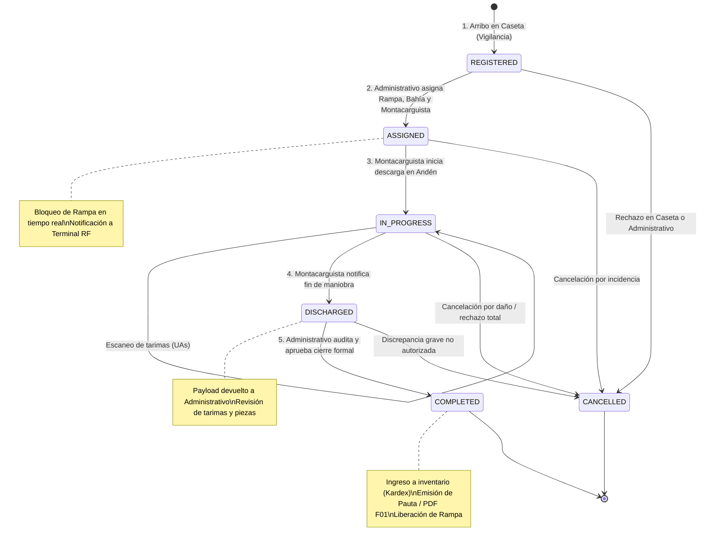
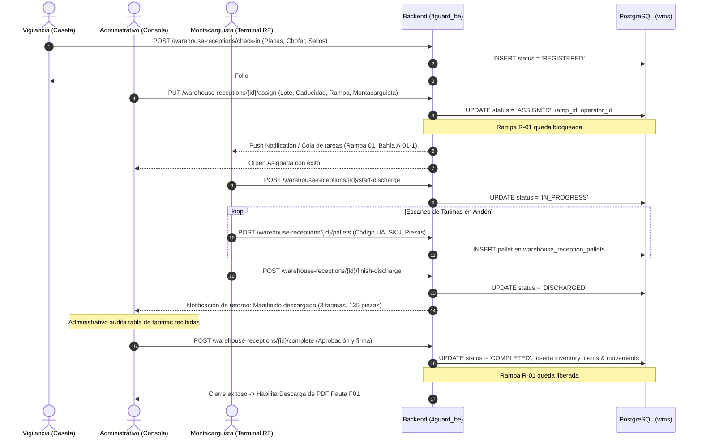
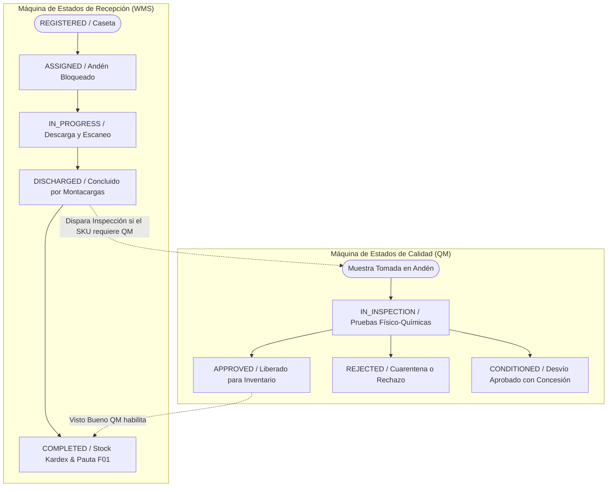

# ADR-017: Ciclo de Vida Operativo de Movimientos de Almacén (Inbound/Outbound): Desacoplamiento de Caseta (Vigilancia), Mesa Administrativa, Terminales RF de Montacarguistas y Cierre Documental

- **Estado:** Aceptado
- **Fecha:** 2026-09-15
- **Autores:** Equipo de Arquitectura e Ingeniería 4GUARD WMS (Frontend, Backend & BD)
- **Módulos Afectados:**
  - `4guard_be/src/main/java/com/fourguard/wms/domain/enums/ReceptionStatus.java`
  - `4guard_be/src/main/java/com/fourguard/wms/application/usecase/WarehouseReceptionService.java`
  - `4guard_be/src/main/resources/db/migration/V17__expand_reception_status_lifecycle.sql`
  - `wms.warehouse_receptions`, `wms.warehouse_outbounds`
  - `apps/admin-console/src/app/features/warehouse-movements`
  - `apps/rf-terminal` (Handhelds / Terminales de Montacarguistas)
  - Futuro módulo de Vigilancia Patrimonial / Caseta de Acceso

---

## 1. Contexto y Problema Operativo

El flujo anterior de Recepción de Mercancía (`F01`) manejaba un ciclo simplificado de tres estados (`REGISTERED` -> `COMPLETED` / `CANCELLED`), en el cual la misma pantalla asumía que la captura en caseta, la asignación de parámetros, el escaneo físico de tarimas y el cierre documental ocurrían en un único paso concurrente.

En la operación real de almacenes y CEDIS con alto volumen:
1. **Desacoplamiento de Roles Físicos y Geográficos:**
   - **Vigilancia (Caseta de Seguridad):** Ubicada en la entrada perimetral. Registra datos de arribo vehicular (transportista, operador, placas, documento y sellos/cinchos).
   - **Mesa Administrativa / Supervisor de Almacén:** Ubicada en oficinas operativas. Revisa documentación fiscal, asigna lote, fechas, bahía WMS (`auto-slotting`), andén y montacarguista responsable.
   - **Montacarguistas (Operadores de Piso):** Ubicados en andén con terminales móviles (`rf-terminal`). Reciben tareas despachadas, validan el tráiler, descargan la mercancía y escanean individualmente los códigos de barra de tarima (UAs/SSCC).
   - **Cierre Documental (Auditoría):** Al finalizar la descarga física, el montacarguista notifica a la mesa administrativa, quien audita el conteo de tarimas/piezas y autoriza formalmente la Pauta de Recepción (`F01`).

2. **Bloqueo Exclusivo de Andenes (Rampas 1 a 12):**
   - Una rampa asignada debe permanecer bloqueada (`OCUPADA`) desde el momento en que el administrativo autoriza el andén hasta que la maniobra física finaliza y se libera la unidad, evitando colisiones de tráfico vehicular.

3. **Acumulación de Maniobras para Montacarguistas:**
   - Un montacarguista puede tener en cola múltiples descargas y cargas asignadas por el jefe de turno, gestionándolas de forma secuencial en su terminal.

---

## 2. Decisión de Arquitectura: Ciclo de Vida de 5 Fases

Se formaliza una máquina de estados determinista tanto en Base de Datos PostgreSQL, Backend Hexagonal y Frontend Angular Signals.

### 2.1 Fases del Ciclo de Vida Operativo

| Estado | Nombre Operativo | Actor Responsable | Interfaz | Acción Clave |
|---|---|---|---|---|
| `REGISTERED` | **Registrada en Caseta** | Vigilancia / Caseta | Módulo de Vigilancia / Pre-Recepción | Arribo vehicular, placas, transportista, sellos. Andén pendiente. |
| `ASSIGNED` | **Asignada a Andén** | Administrativo / Jefe Turno | Consola Admin (`admin-console`) | Asignación de lote, caducidad, bahía WMS, rampa y montacarguista. **Bloquea rampa**. Despacha a terminal RF. |
| `IN_PROGRESS` | **En Descarga Activa** | Montacarguista | Terminal Móvil (`rf-terminal`) | Validación física en andén. Escaneo activo de códigos de tarima (UAs). |
| `DISCHARGED` | **Descarga Finalizada** | Montacarguista → Admin | Terminal Móvil → Admin | Montacarguista confirma fin de maniobra física. Devuelve manifiesto escaneado al administrativo para auditoría. |
| `COMPLETED` | **Completada y Cerrada** | Supervisor / Administrativo | Consola Admin (`admin-console`) | Auditoría de piezas/tarimas recibidas, visto bueno, ingreso formal a `inventory_items` y emisión de PDF Pauta F01. **Libera rampa**. |
| `CANCELLED` | **Cancelada** | Administrador / Supervisor | Consola Admin (`admin-console`) | Cancelación extraordinaria con justificación obligatoria y credenciales de seguridad. Libera rampa. |

---

### 2.2 Diagrama de Estados (Statechart)



---

### 2.3 Diagrama de Secuencia Multi-Actor



---

## 3. Adecuaciones Técnicas en Base de Datos y Backend

1. **Migración Flyway (`V17__expand_reception_status_lifecycle.sql`):**
   ```sql
   ALTER TABLE wms.warehouse_receptions DROP CONSTRAINT IF EXISTS chk_wr_status;
   ALTER TABLE wms.warehouse_receptions ADD CONSTRAINT chk_wr_status 
       CHECK (status IN ('REGISTERED', 'ASSIGNED', 'IN_PROGRESS', 'DISCHARGED', 'COMPLETED', 'CANCELLED'));
   ```

2. **Enum de Dominio (`ReceptionStatus.java`):**
   Se expande para incluir los estados `ASSIGNED`, `IN_PROGRESS` y `DISCHARGED`.

3. **Bloqueo Dinámico de Rampas:**
   Una rampa se considera ocupada por Inbound si existe una recepción activa en estatus `ASSIGNED`, `IN_PROGRESS` o `DISCHARGED`. Se libera automáticamente al pasar a `COMPLETED` o `CANCELLED`.

### 3.5 Arquitectura Transversal de Máquinas de Estado (FSM) para Calidad (QM) y Logística

En concordancia con el estándar arquitectónico de 4GUARD, el módulo de **Control de Calidad (QM)** y el de **Movimientos de Almacén** comparten el mismo patrón determinista de Máquina de Estados Finitos (FSM):



---

## 4. Consecuencias y Beneficios

### Positivas
- **Separación Limpia de Responsabilidades:** Vigilancia no necesita conocer datos de lote o SKU; el administrativo no necesita estar físicamente en andén; el montacarguista solo se enfoca en verificar producto y escanear tarimas.
- **Preparación Nativa para el Módulo de Vigilancia:** La arquitectura permite que cuando se agregue la pantalla dedicada de Vigilancia, simplemente invoque el endpoint `/check-in` existente sin alterar el resto del almacén.
- **Control Anticolisiones de Andenes:** Imposibilidad de que dos transportes sean dirigidos a la misma rampa simultáneamente.
- **Auditoría Transaccional Rigurosa:** El administrativo cuenta con un paso explícito de verificación (`DISCHARGED`) antes de que la mercancía afecte el inventario contable y fiscal.
- **Homogeneidad con Máquinas de Estado de Calidad (QM):** Garantiza que los estados de liberación de calidad, retenciones de lote (*Lot Holds*) y cuarentenas se sincronicen de forma limpia con los movimientos físicos del almacén.
