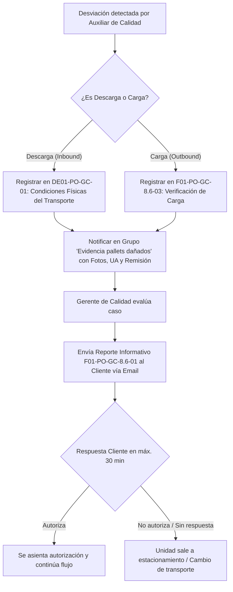

# IT01-PO-GC-8.6-01 Rev. 01: Criterios de Aceptación y Rechazo en Inspección Visual

> **Código Oficial:** `IT01-PO-GC-8.6-01`  
> **Revisión:** 01 (Vigente desde 17/09/2025)  
> **Proceso Asociado:** `PO-GC-8.6-01` (Liberación de Descarga) y `PO-GC-8.6-03` (Liberación de Carga)  
> **Responsables:** Auxiliar de Calidad (AC), Gerente de Calidad (GC)

---

## 1. Objetivo y Alcance

Establecer los criterios estandarizados de **inspección visual no destructiva** de producto y unidades de transporte durante las operaciones de descarga (Inbound) y carga (Outbound) en los almacenes de 4GUARD, garantizando que solo ingrese o se despache material en condiciones óptimas de calidad, inocuidad y seguridad.

---

## 2. Criterios de Aceptación y Rechazo en Material / Producto

| Parámetro / Criterio | Criterio de Aceptación (Conforme) | Criterio de Rechazo (No Conforme / Bloqueo) | Acción Correctiva / Procedimiento |
| :--- | :--- | :--- | :--- |
| **Empaque Primario** | Máximo **1 unidad dañada** por pallet. | **Más de 1 unidad dañada** por pallet. | Bloqueo PNC (`PG-CG-8.7-01`) o acondicionamiento según `IT02-PO-GC-8.6-02`. |
| **Empaque Secundario** | Máximo **2 cajas dañadas** por pallet, sin comprometer el producto interno. | **Más de 2 cajas dañadas** por pallet. | Retiro de cajas dañadas / acondicionamiento bajo `IT02-PO-GC-8.6-02`. |
| **Embalaje / Emplaye** | Sin aberturas mayores a **5 cm**. | Aberturas o rasgaduras **mayores a 5 cm**. | Re-emplaye o sellado con Diurex (este último solo en frascos). |
| **Identificación / Etiquetas** | **100% presentes, legibles y completas** (SKU, lote, proveedor, caducidad/fabricación). | Etiquetas faltantes, rotas, ilegibles o desfasadas de la remisión. | Bloqueo documental y solicitud de re-etiquetado. |
| **Estructura de Tarima** | Buenas condiciones, tacones completos, sin cintas adheridas, grapas ni clavos sueltos. | **Más de 1 tabla rota**, sin tacones, clavos expuestos o cintas adheridas. | Traspaleo completo de tarima según `IT02-PO-GC-8.6-02`. |
| **Estabilidad de Estiba** | Producto alineado, **inclinación máxima $\le 5^\circ$**. | Inclinación **$> 5^\circ$** (producto ladeado o con riesgo de colapso). | Re-alineación y re-emplayado inmediato. |
| **Humedad / Manchas** | **0% humedad visible**, libre de moho y condensación. | Evidencia de humedad, filtraciones, manchas o moho. | Bloqueo `CRITICAL` (Rojo) y separación inmediata. |
| **Plagas y Olores** | **Ausencia total (0 tolerancia)** de plagas, excretas, telarañas u olores extraños. | Cualquier indicio de plagas o aroma a químico/combustible/humedad. | Bloqueo total `CRITICAL` + Reporte a Dirección y Cliente. |

---

## 3. Criterios de Aceptación y Rechazo en Unidades de Transporte

| Componente Transporte | Criterio de Aceptación | Criterio de Rechazo | Acción Requerida |
| :--- | :--- | :--- | :--- |
| **Caja Cerrada / Lona** | Sin perforaciones ni claros de luz. Se permite máx. **1 rasgadura $\le 5\text{ cm}$** siempre que esté sellada y no filtre luz. | Rasgaduras o perforaciones **$> 5\text{ cm}$** o que dejen pasar luz exterior. | Rechazo de unidad / Notificación al cliente mediante F01. |
| **Paredes Internas** | Limpias. Se permite polvo ligero. Sin manchas de grasa/hollín **$> 10\text{ cm}$** de diámetro ni residuos adheridos. | Manchas de grasa/hollín **$> 10\text{ cm}$**, óxido suelto, moho o manchas húmedas. | Solicitud de limpieza o rechazo de unidad. |
| **Puertas y Empaques** | Limpias, cierre hermético; empaques de hule sin cortes **$> 5\text{ cm}$**; bisagras funcionales. | Puertas que no sellen, empaques rotos/cortados **$> 5\text{ cm}$**, seguros dañados. | Rechazo de unidad. |
| **Indicios de Plagas** | **0 tolerancia** a insectos vivos/muertos, excretas, plumas, nidos o telarañas. | Cualquier indicio de fauna nociva. | Rechazo fulminante de la unidad. |
| **Aromas / Olores** | Olor neutro o a madera limpia. **0 tolerancia** a aromas químicos, combustibles o humedad. | Olor a diésel, gasolina, solvente, pesticida o humedad/podredumbre. | Rechazo de unidad. |
| **Condición del Piso** | Limpio, seco, sin charcos. Permitido polvo seco. Sin residuos sueltos **$> 5\text{ cm}$** ni clavos salientes. | Charcos, derrames químicos, **$> 3$ residuos sueltos de $> 5\text{ cm}$**, astillas o clavos salientes. | Limpieza obligatoria o rechazo. |
| **Llantas** | Buen estado, sin desgaste excesivo, sin grietas profundas ni objetos incrustados. | Llantas lisas, agrietadas o con deformaciones evidentes. | Reporte a seguridad patrimonial. |
| **Bloqueo de Seguridad** | Obligatorio en carga foránea: cartón separador, bolsas de aire, eslingas o gatas colocadas funcionalmente. | Carga foránea sin dispositivos de sujeción o con bolsas ponchadas. | Detener despacho hasta asegurar la carga. |

---

## 4. Flujo de Notificación ante Desviaciones

