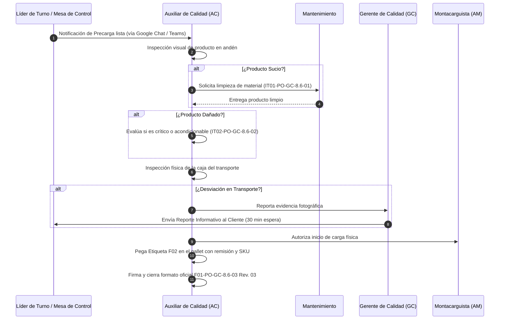

# PO-GC-8.6-03 Rev. 01: Procedimiento Oficial de Liberación de Carga (Outbound)

> **Código Oficial:** `PO-GC-8.6-03`  
> **Revisión:** 01 (Vigente desde 17/09/2025)  
> **Formato Asociado:** `F01-PO-GC-8.6-03 Rev. 03` (Verificación de Carga) y `F02-PO-GC-8.6-03` (Etiqueta de Liberación)  
> **Norma Referencia:** ISO 9001:2015 Cláusula 8.6 (Liberación de los productos y servicios)

---

## 1. Flujo Operativo de Embarque y Liberación

---

## 2. Los 18 Criterios del Formato Oficial F01-PO-GC-8.6-03 Rev. 03

### Criterios de Producto (9 Criterios):
1. **`crit-prod-1`:** Tarima en buen estado (habilitada para montacargas). *(Si NO $\rightarrow$ Aplica IT02)*
2. **`crit-prod-2`:** Pallet sin daños (sin producto expuesto o dañado). *(Si NO $\rightarrow$ Aplica IT02)*
3. **`crit-prod-3`:** Embalaje en buen estado (sin aberturas que afecten inocuidad). *(Si NO $\rightarrow$ Aplica IT02)*
4. **`crit-prod-4`:** Pallets limpios (sin manchas, sustancias ajenas o exceso de polvo). *(Si NO $\rightarrow$ Aplica IT01 + Firma obligatoria de limpieza)*
5. **`crit-prod-5`:** Pallet visualmente estable y alineado ($\le 5^\circ$). *(Si NO $\rightarrow$ Aplica IT02)*
6. **`crit-prod-6`:** Producto coincide al 100% con lo solicitado por el cliente.
7. **`crit-prod-7`:** Material identificado con UA del cliente.
8. **`crit-prod-8`:** Producto **libre de cualquier tipo de plaga** *(Crítico)*.
9. **`crit-prod-9`:** Otros requerimientos específicos.

### Criterios de Transporte (9 Criterios):
1. **`crit-trans-1`:** Camión cerrado o lona en buenas condiciones (sin rasgaduras $> 5\text{ cm}$).
2. **`crit-trans-2`:** Paredes internas limpias (sin grasa/hollín $> 10\text{ cm}$).
3. **`crit-trans-3`:** Puertas limpias y con cierre hermético funcional.
4. **`crit-trans-4`:** Libre de indicios de plagas evidentes.
5. **`crit-trans-5`:** Libre de aromas extraños (combustible, químicos, humedad).
6. **`crit-trans-6`:** Piso limpio, sin charcos ni elementos cortantes (clavos).
7. **`crit-trans-7`:** Libre de perforaciones o claros de luz.
8. **`crit-trans-8`:** Llantas de la unidad en buen estado mecánico.
9. **`crit-trans-9`:** Bloqueo de seguridad instalado (cartón, bolsas de aire, eslingas) en viajes foráneos.

---

## 3. Etiquetado F02 y Cierre Documental

* **Colocación de Etiqueta F02:** Se coloca en el pallet que contiene el mapa de carga y remisión escrita.
* **Datos Obligatorios en F02:**
  - SKU del material liberado.
  - Número de remisión.
  - Nombre y firma del Auxiliar de Calidad.
  - Fecha y hora exacta de la liberación.
* **Condición de Inicio de Carga:** El montacarguista tiene **estrictamente prohibido** subir pallets al camión hasta que Calidad emita la autorización formal.
