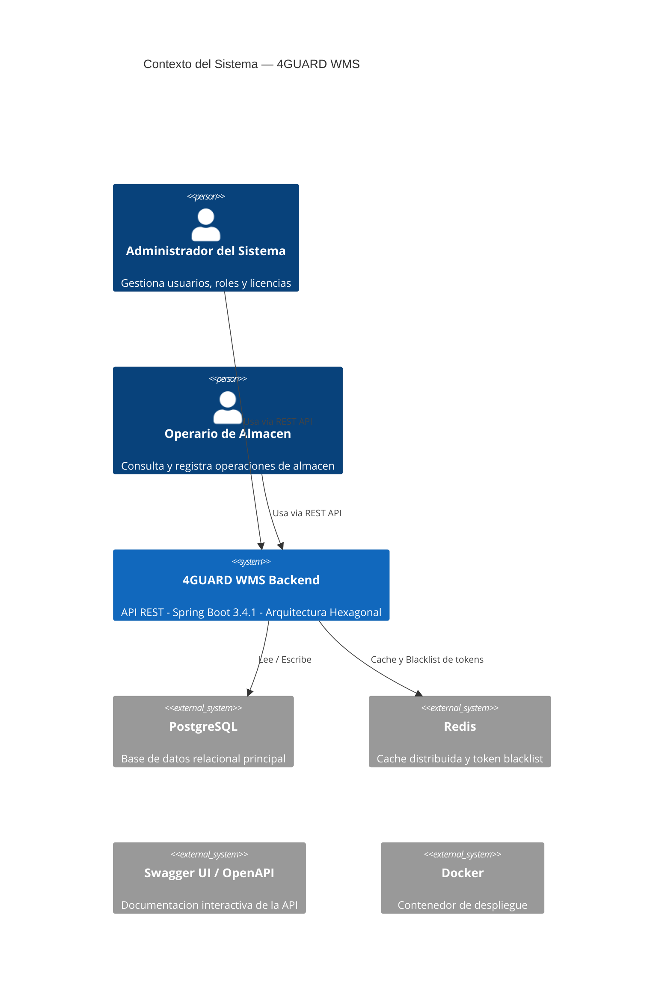
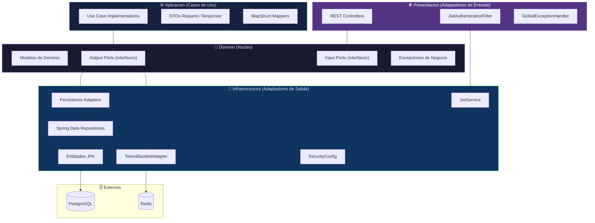
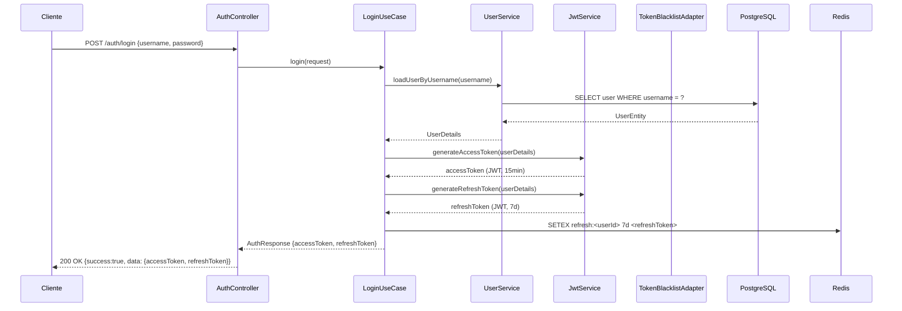
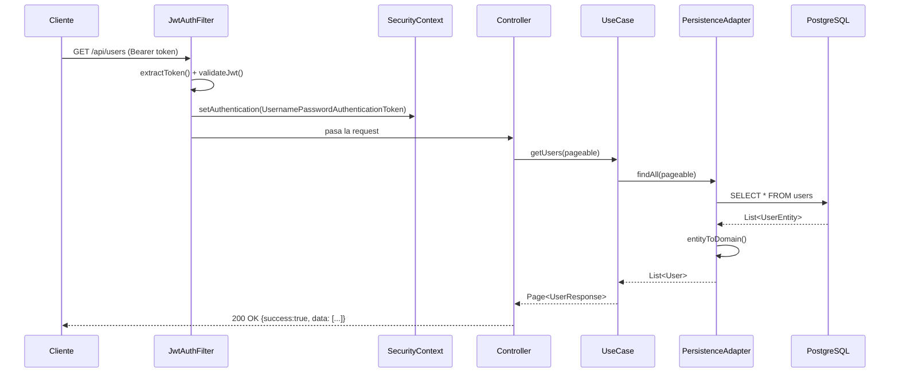
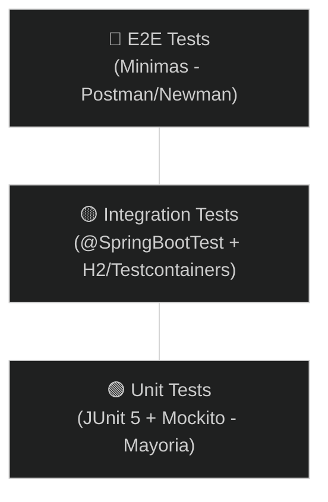

# System Design Document (SDD)
## 4GUARD WMS — Backend REST API

**Version:** 1.0.0  
**Fecha:** 2026-08-12  
**Estado:** Activo (Living Document)  
**Autores:** Equipo 4GUARD

---

## Tabla de Contenido

1. [Vision General](#1-vision-general)
2. [Contexto del Sistema](#2-contexto-del-sistema)
3. [Arquitectura Hexagonal](#3-arquitectura-hexagonal)
4. [Componentes Principales](#4-componentes-principales)
5. [Flujos de Datos Criticos](#5-flujos-de-datos-criticos)
6. [Puertos de Entrada (Input Ports)](#6-puertos-de-entrada-input-ports)
7. [Puertos de Salida (Output Ports)](#7-puertos-de-salida-output-ports)
8. [Seguridad y Autenticacion](#8-seguridad-y-autenticacion)
9. [Estrategia de Persistencia](#9-estrategia-de-persistencia)
10. [Cache](#10-cache)
11. [Tecnologias y Versiones](#11-tecnologias-y-versiones)
12. [Estrategia de Pruebas](#12-estrategia-de-pruebas)
13. [Despliegue y Operacion](#13-despliegue-y-operacion)
14. [Reglas de Negocio Criticas](#14-reglas-de-negocio-criticas)
15. [ADRs Relacionados](#15-adrs-relacionados)
16. [Historial de Cambios](#16-historial-de-cambios)

---

## 1. Vision General

**4GUARD WMS** es un sistema de gestion de almacen (Warehouse Management System) diseñado
para gestionar usuarios, organizaciones, sucursales, roles, permisos, proveedores,
secciones de almacen, turnos, monedas, carriers y licencias de manera centralizada.

El sistema expone una **API REST** consumida por el frontend web de 4GUARD y potencialmente
por servicios internos. Esta construido sobre **Spring Boot 3.4.1** con **Java 17**,
siguiendo estrictamente la **Arquitectura Hexagonal (Ports and Adapters)**.

### Principios de diseño
- **Independencia del dominio**: La logica de negocio no depende de Spring, JPA ni ningun framework.
- **Testabilidad**: Los casos de uso pueden probarse sin contexto Spring.
- **Separacion de responsabilidades**: Cada capa tiene una responsabilidad bien definida.
- **Documentacion como codigo**: ADRs y SDD versionados junto al codigo fuente.

---

## 2. Contexto del Sistema



---

## 3. Arquitectura Hexagonal



---

## 4. Componentes Principales

### 4.1 Modulos de Negocio

| Modulo               | Descripcion                                              | Input Port           | Output Port                  |
|----------------------|----------------------------------------------------------|----------------------|------------------------------|
| **User**             | CRUD de usuarios, estado, reset de password              | `UserUseCase`        | `UserRepositoryPort`         |
| **Role**             | Gestion de roles y asignacion de permisos                | `RoleUseCase`        | `RoleRepositoryPort`         |
| **Permission**       | Catalogo de permisos granulares del sistema              | `PermissionUseCase`  | `PermissionRepositoryPort`   |
| **Organization**     | Gestion de organizaciones (multi-tenant)                 | `UpdateOrganizationUseCase` | `OrganizationRepositoryPort` |
| **Branch**           | Gestion de sucursales por organizacion                   | `UpdateBranchUseCase`| `BranchRepositoryPort`       |
| **Supplier**         | Gestion completa de proveedores con contactos y terminos | `SupplierUseCase`    | `SupplierRepositoryPort`     |
| **WarehouseSection** | Secciones fisicas del almacen                            | `WarehouseSectionUseCase` | `WarehouseSectionRepositoryPort` |
| **Shift**            | Turnos de trabajo y asignacion                           | `ShiftUseCase`       | `ShiftRepositoryPort`        |
| **Carrier**          | Transportistas y operadores                              | *(ver controlador)*  | `CarrierRepositoryPort`      |
| **Currency**         | Catalogo de monedas                                      | *(ver controlador)*  | `CurrencyRepositoryPort`     |
| **ProductSku**       | Catalogo de SKUs de productos                            | `ProductSkuUseCase`  | `ProductSkuRepositoryPort`   |
| **WmsLicense**       | Gestion de licencias del sistema WMS                     | `WmsLicenseUseCase`  | `WmsLicenseRepositoryPort`   |
| **Auth**             | Login, refresh token, logout, reset de password          | `LoginUseCase`, `RefreshTokenUseCase`, `RevokeUserSessionUseCase` | `UserRepositoryPort`, `TokenBlacklistPort` |

### 4.2 Componentes Transversales

| Componente              | Ubicacion              | Funcion                                        |
|-------------------------|------------------------|------------------------------------------------|
| `ApiResponse<T>`        | `shared.response`      | Envoltorio estandar para todas las respuestas  |
| `RequestLoggingFilter`  | `presentation.filter`  | Log de requests HTTP entrantes                 |
| `GlobalExceptionHandler`| `presentation.advice`  | Mapeo centralizado de excepciones a HTTP codes |
| `SecurityAuditHelper`   | `shared.audit`         | Trazabilidad de acciones por usuario autenticado |
| `SecurityConfig`        | `infrastructure.configuration` | Configuracion de Spring Security y JWT   |
| `SwaggerConfig`         | `infrastructure.configuration` | Configuracion de SpringDoc / OpenAPI     |
| `RedisConfig`           | `infrastructure.configuration` | Configuracion condicional de Redis       |

---

## 5. Flujos de Datos Criticos

### 5.1 Flujo de Autenticacion (Login)



### 5.2 Flujo de Request Autenticado



---

## 6. Puertos de Entrada (Input Ports)

Contratos definidos en `domain.ports.in`. Las implementaciones viven en `application.usecase`.

| Interface                     | Metodos clave                              |
|-------------------------------|--------------------------------------------|
| `UserUseCase`                 | `createUser`, `updateUser`, `deleteUser`, `getUserById` |
| `RoleUseCase`                 | `createRole`, `updateRole`, `assignPermissions` |
| `PermissionUseCase`           | `getPermissions`, `getPermissionById`      |
| `SupplierUseCase`             | `createSupplier`, `updateSupplier`, `filterSuppliers` |
| `ShiftUseCase`                | `createShift`, `updateShift`, `filterShifts` |
| `WmsLicenseUseCase`           | `createLicense`, `renewLicense`, `suspendLicense` |
| `LoginUseCase`                | `login(credentials)`                      |
| `RefreshTokenUseCase`         | `refreshToken(refreshToken)`               |
| `RevokeUserSessionUseCase`    | `revokeSession(userId, token)`             |
| `ResetUserPasswordUseCase`    | `resetPassword(userId, newPassword)`       |
| `UpdateOrganizationUseCase`   | `updateOrganization(request)`              |
| `UpdateBranchUseCase`         | `updateBranch(request)`                    |

---

## 7. Puertos de Salida (Output Ports)

Contratos definidos en `domain.ports.out`. Las implementaciones viven en `infrastructure.persistence.adapter`.

| Interface                        | Implementacion                          |
|----------------------------------|-----------------------------------------|
| `UserRepositoryPort`             | `UserPersistenceAdapter`                |
| `RoleRepositoryPort`             | `RolePersistenceAdapter`                |
| `PermissionRepositoryPort`       | `PermissionPersistenceAdapter`          |
| `SupplierRepositoryPort`         | `SupplierPersistenceAdapter`            |
| `ShiftRepositoryPort`            | `ShiftPersistenceAdapter`               |
| `WarehouseSectionRepositoryPort` | `WarehouseSectionPersistenceAdapter`    |
| `WmsLicenseRepositoryPort`       | `WmsLicenseRepositoryAdapter`           |
| `TokenBlacklistPort`             | `TokenBlacklistAdapter` (Redis)         |
| `UserAdminQueryPort`             | `UserAdminQueryAdapter`                 |

---

## 8. Seguridad y Autenticacion

- **Autenticacion**: JWT sin estado (ver ADR-003).
- **Autorizacion**: `@PreAuthorize` con authorities granulares.
- **Filter Chain**: `JwtAuthenticationFilter` se ejecuta antes de `UsernamePasswordAuthenticationFilter`.
- **CORS**: Configurado en `SecurityConfig`.
- **Endpoints publicos**: `/auth/**`, `/actuator/health`, `/swagger-ui/**`, `/v3/api-docs/**`.
- **Endpoints protegidos**: Todo lo demas requiere token valido.

### Matriz de authorities (ejemplos)

| Authority       | Descripcion                              |
|-----------------|------------------------------------------|
| `SYS_ADMIN`     | Acceso total al sistema                  |
| `BRANCH_MANAGER`| Gestion de su sucursal                   |
| `WAREHOUSE_OP`  | Operaciones de almacen de solo lectura   |

---

## 9. Estrategia de Persistencia

- **ORM**: Spring Data JPA + Hibernate 6.x (ver ADR-002).
- **Base de datos**: PostgreSQL.
- **Migraciones**: Flyway (ver ADR-006). Scripts en `src/main/resources/db/migration/`.
- **Patron Repository**: Spring Data `JpaRepository` + `PersistenceAdapter` como anti-corruption layer.
- **Tipos especiales**: JSONB para configuraciones flexibles via Hypersistence Utils.

---

## 10. Cache

- **Proveedor**: Redis (ver ADR-004).
- **Configuracion**: Condicional por propiedad `cache.redis.enabled`.
- **Usos actuales**:
  - Refresh tokens activos.
  - Blacklist de access tokens revocados.
- **Usos planificados**: Cache de permisos por usuario.

---

## 11. Tecnologias y Versiones

| Tecnologia            | Version      | Rol                                   |
|-----------------------|-------------|---------------------------------------|
| Java                  | 17          | Lenguaje de programacion              |
| Spring Boot           | 3.4.1       | Framework principal                   |
| Spring Security       | 6.x         | Autenticacion y autorizacion          |
| Spring Data JPA       | 3.x         | ORM y repositorios                    |
| Hibernate             | 6.x         | JPA Provider                          |
| PostgreSQL            | 15+         | Base de datos relacional              |
| Flyway                | 10.x        | Migraciones de esquema                |
| Redis                 | 7.x         | Cache distribuida                     |
| JJWT                  | 0.12.6      | Generacion y validacion de JWT        |
| MapStruct             | 1.6.3       | Mapeo de objetos en compilacion       |
| Lombok                | 1.18.36     | Reduccion de boilerplate              |
| SpringDoc OpenAPI     | 2.7.0       | Documentacion Swagger UI              |
| Hypersistence Utils   | 3.9.0       | Tipos JSONB en Hibernate 6            |
| Docker                | -           | Contenedor de despliegue              |
| Maven                 | 3.9+        | Build y gestion de dependencias       |

---

## 12. Estrategia de Pruebas

### Piramide de pruebas



| Tipo         | Framework                           | Cobertura objetivo |
|--------------|-------------------------------------|--------------------|
| Unitarias    | JUnit 5 + Mockito                   | Use cases, mappers, validaciones |
| Controladores| MockMvc Standalone                  | HTTP codes, estructura ApiResponse |
| Integracion  | @SpringBootTest + H2 / Testcontainers | Flujos end-to-end internos |

### Comandos

```bash
# Ejecutar todas las pruebas
mvn clean test

# Con reporte de cobertura (Jacoco - cuando se configure)
mvn clean verify
```

---

## 13. Despliegue y Operacion

### Ejecucion local

```bash
# Pre-requisitos: JDK 17, Maven, PostgreSQL, Redis
mvn spring-boot:run

# Con Docker Compose
docker-compose up -d
```

### Swagger UI
```
http://localhost:8080/swagger-ui/index.html
```

### Health Check (Actuator)
```
http://localhost:8080/actuator/health
```

### Variables de entorno requeridas

| Variable               | Descripcion                    |
|------------------------|--------------------------------|
| `DB_URL`               | JDBC URL de PostgreSQL         |
| `DB_USERNAME`          | Usuario de base de datos       |
| `DB_PASSWORD`          | Contrasena de base de datos    |
| `JWT_SECRET`           | Clave secreta para firmar JWT  |
| `JWT_EXPIRATION_MS`    | Expiracion del access token    |
| `REDIS_HOST`           | Host de Redis                  |
| `REDIS_PORT`           | Puerto de Redis (default 6379) |

---

## 14. Reglas de Negocio Criticas

1. **Unicidad de usuarios**: El `username` y el `email` deben ser unicos en el sistema.
   Validacion en capa de aplicacion antes de persistir.

2. **Licencias activas**: Un usuario solo puede pertenecer a una organizacion con licencia activa (`WmsLicense.status = ACTIVE`).

3. **Roles y permisos**: Un usuario tiene exactamente un rol. Un rol tiene N permisos.
   Los permisos son granulares y determinan el acceso a cada endpoint.

4. **Token blacklist**: Al hacer logout, el JTI del access token se agrega a Redis con TTL
   igual al tiempo restante del token. Ningun token en blacklist puede autenticar.

5. **Migraciones inmutables**: Los scripts SQL de Flyway no se modifican una vez aplicados.
   Cualquier cambio requiere una nueva migracion.

---

## 15. ADRs Relacionados

| ADR | Titulo | Relevancia |
|-----|--------|------------|
| [ADR-001](../adr/001-arquitectura-hexagonal.md) | Arquitectura Hexagonal | Patron central de diseño |
| [ADR-002](../adr/002-spring-data-jpa.md) | Spring Data JPA y PostgreSQL | Persistencia |
| [ADR-003](../adr/003-jwt-autenticacion.md) | JWT para autenticacion | Seguridad |
| [ADR-004](../adr/004-redis-cache.md) | Redis para cache | Cache y token blacklist |
| [ADR-005](../adr/005-mapstruct-mapeo.md) | MapStruct para mapeo | Transformacion de objetos |
| [ADR-006](../adr/006-flyway-migraciones.md) | Flyway para migraciones | Control de esquema |

---

## 16. Historial de Cambios

| Version | Fecha      | Autor     | Descripcion                         |
|---------|------------|-----------|-------------------------------------|
| 1.0.0   | 2026-08-12 | Equipo 4GUARD | Documento inicial creado      |
